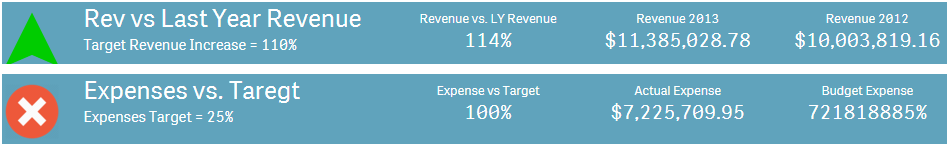
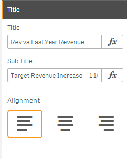
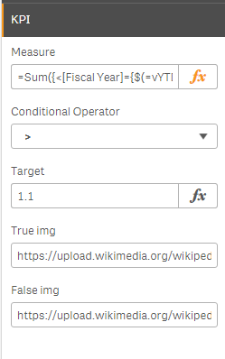
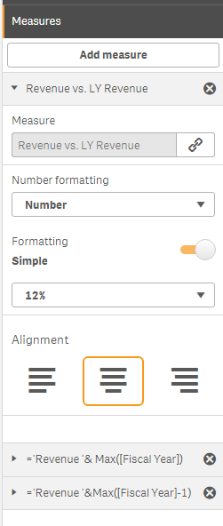

# KPIwithImgDisplay
My first extension from scratch. there are many kpi extensions availbale but wanted to build one for the specific purpose for current project at work. Currently using it into Qlik Sense mashup and thought to share it with the community.

Please feel free to reach out to me for any issue or usage of the extension.

Currently working and learning to add more features into extension.

I have tried my best to follow best practice and coding technics. Please suggest if there are any better way to achieve same.

Extension is not using any third party library. It is completly made up of, html, css and javascript.

## Title
* Title : Text/Expression, KPI Title
* Sub Title : Text/Expresion, KPI Sub Title

## KPI
* Measure : Expression for KPI, will be compared with the target to display true or false img
* Conditional Operator : Operator to use for comparision
* Target : Number/Expression to compare with measure using conditional operator
* True Img : Image to display if comparision returns true. It can be web img address or img from the server cotent or local machine if using desktop
* False Img: : Image to display if comparision returns false. It can be web img address or img from the server content or local machine if using desktop

## Measures
* Add sub - KPI to display. Maximum 6 KPIs are allowed

## Author
**Dixit Patel**

[github.com/adp2916](http://github.com/adp2916)

***
